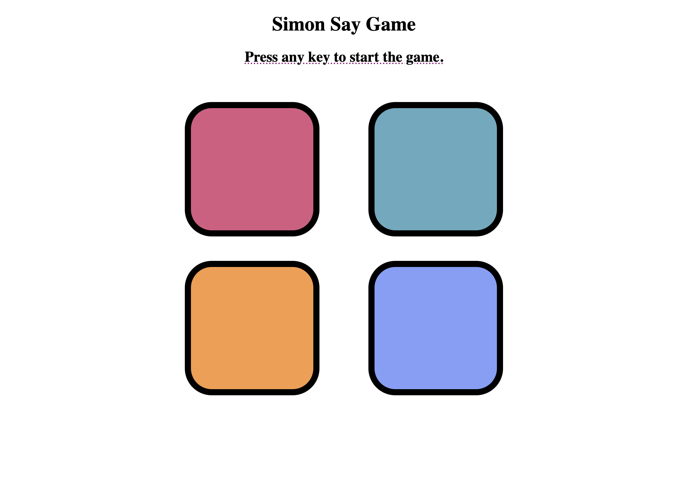

<h1 align="center">🧠✨ JavaScript Atelier</h1> 
    
 
 <b>A curated set of micro-projects built in Vanilla JavaScript, styled to perfection, and designed to teach, inspire, and impress.</b> 

🎮 Simon Say Game — Refined Memory, Reimagined
"Where rhythm meets logic, and memory becomes the game."

A tribute to the timeless classic—this Simon Says game blends modern styling with responsive mechanics. Each interaction is crisp, intuitive, and rewarding.

🧩 Key Features
🎯 Progressive color-sequence generation

⚡ Fast-paced memory challenge

💻 Fully responsive and minimal UI

📸 Game Preview

  

🌈 Background Color Changer — Elegance in a Single Click
"A gentle intro to JS, but with flair."

A compact yet beautifully executed background color changer. Designed for elegance, built for clarity—perfect for beginners and lovers of clean UI.

🎨 Core Highlights
🎲 Random HEX color generation

🎯 One-click background transitions

💡 DOM interaction and event binding

🪶 Feather-light code footprint

🧾 Project Architecture

JavaScript_Projects/
│
├── Simon_say_game/
│   ├── index.html         # Game structure
│   ├── style.css          # Visual design
│   ├── script.js          # Game logic
│   └── Screenshot.png     # UI snapshot
│
└── Background_color_change/
    ├── hex.html           # Color changer layout
    ├── hex.js             # JS logic
    ├── styles.css         # Styling rules
    └── image.png          # Preview image

 ## Skills Demonstrated

✅ Event-driven programming

✅ DOM traversal & manipulation

✅ Timing functions & state management

✅ Component-style separation of concerns

👑 Crafted With Precision By

 <strong>RAJVEER42</strong>  🧑‍💻 Developer • 🧠 Thinker • 🎨 UI Enthusiast  <a href="https://github.com/RAJVEER42" target="_blank">🌐 GitHub</a> 

🛠️ Want to Contribute?
Feel free to fork, explore, improve or remix. PRs are welcome, and ideas are always celebrated.

git clone https://github.com/RAJVEER42/JavaScript_Projects.git
cd JavaScript_Projects
"Perfection is achieved not when there is nothing more to add, but when there is nothing left to take away."
— Antoine de Saint-Exupéry

