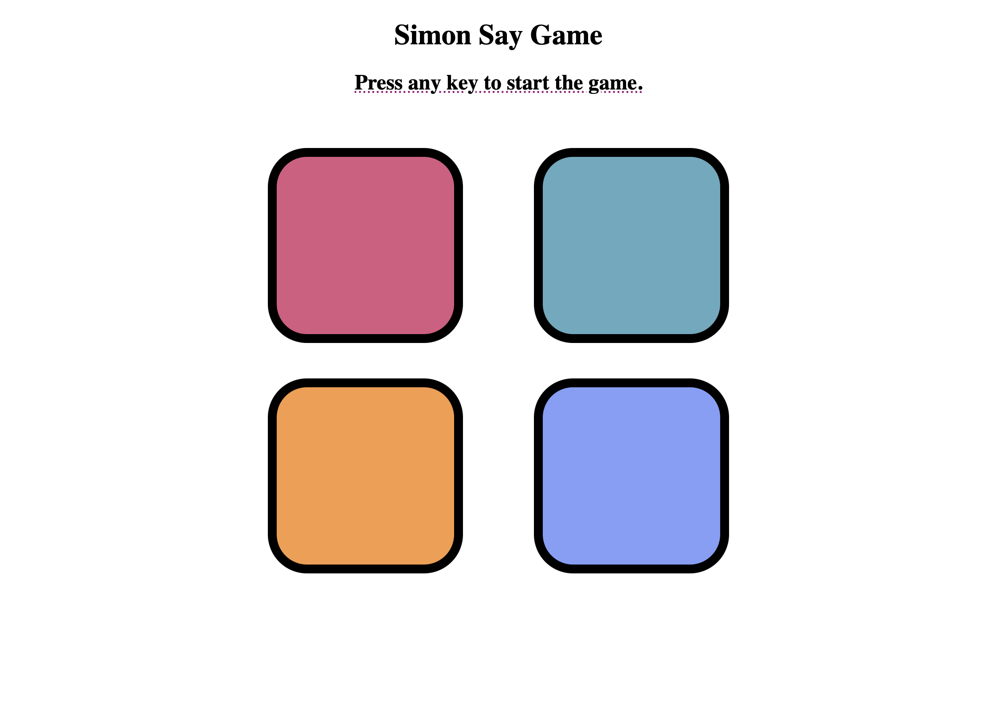

<h1>🎮 Simon Say Game</h1>

A fun and interactive JavaScript game where you have to follow the sequence of colors and repeat it correctly to win!

<h2>📸 Preview</h2>

<h2>🚀 Features</h2>
<ul>
  <li>Dynamic sequence generation</li>
  <li>Level tracking</li>
  <li>Simple UI with color-coded buttons</li>
  <li>Responsive gameplay logic</li>
</ul>

<h2>📁 Project Structure</h2>
<pre>
.
├── index.html
├── style.css
├── script.js
└── README.md
</pre>

<h2>🔧 How to Run</h2>
<ol>
  <li>Clone the repo: <code>git clone https://github.com/RAJVEER42/JavaScript_Projects.git</code></li>
  <li>Open <code>index.html</code> in your browser</li>
  <li>Enjoy the game!</li>
</ol>

<h2>🛠️ Technologies Used</h2>
<ul>
  <li>HTML</li>
  <li>CSS</li>
  <li>JavaScript (Vanilla)</li>
</ul>

<h2>📬 Feedback</h2>

Feel free to raise an issue or submit a pull request if you'd like to improve the game!

<h2>~ Rajveer Bishnoi</h2>
